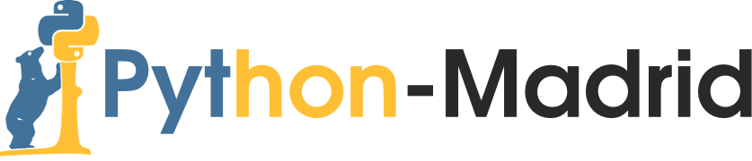

## MIÉRCOLES 27/JUL/2016
# [Reunión Julio 2016: Taller básico de Python Científico](http://www.meetup.com/es-ES/Madrid-Python-Meetup/events/232582139/)

### SIRO MORENO, ALEJANDRO SÁEZ MOLLEJO
#### NIVEL: INICIACIÓN
## Información General

Hola pythonistas! En nuestra última reunión antes del parón veraniego hemos decidido hacer algo diferente y orientado a aquellos que aún estén empezando con el lenguaje, que quieran aprender o que estén interesados en descubrir las posibilidades de Python para ciencia e ingeniería.

Para ello, [Álex Sáez](https://www.linkedin.com/in/alejandrosaezm/) y [Siro Moreno](https://www.linkedin.com/in/siro-moreno-mart%C3%ADn-1bab18b7/en) repetirán el taller básico de introducción a Python científico que ya impartieron en la PyData Madrid y que podéis ver en vídeo:

https://youtu.be/kZo_nmpkzr0

De nuevo CIFF Business School nos cede amablemente sus instalaciones para que podamos celebrar este taller.

Recalcamos que este es un taller de introducción, y que por tanto son bienvenidos todos aquellos que estén interesados en aprender. Los que ya sean expertos van a sacar poco en claro ;)

Para poder seguir el taller de forma autónoma será necesario traer portátil con Anaconda instalado. Si te surgen dudas puedes seguir esta guía de instalación:

[http://nbviewer.jupyter.org/github/AeroPython/Curso_AeroPython/blob/master/notebooks_completos/Clase0_Bienvenido.ipynb](http://nbviewer.jupyter.org/github/AeroPython/Curso_AeroPython/blob/master/notebooks_completos/Clase0_Bienvenido.ipynb)

Cada asistente tendrá mesa, silla y enchufe. 

¡Un saludo y nos vemos en Python Madrid!

## Descripción

The Aeropython’s guide to the Python Galaxy! 

Este taller será un introducción a algunos de los paquetes más habituales del entorno científico. Comenzaremos explorando el Jupyter Notebook, que usaremos durante toda las sesión, introduciremos el funcionamiento básico de los arrays de NumPy, haremos nuestras primeras representaciones gráficas con matplotlib, veremos algunas de las funcionalidades que ofrece SciPy y mostraremos las posibilidades para hacer cálculo simbólico que proporciona SymPy.

Usaremos [Anaconda Python 3.5.1 distribution](https://www.continuum.io/downloads) y los siguientes paquetes:

* IPython 5
* IPython-Notebook 4.1.1
* IPyWidgets 4.1.1
* matplotlib 1.5.1
* SciPy 0.17.1
* SymPy 1.0

¡Trata de instalarlos antes!

Este taller es una adaptación del [Curso de Introducción a Python para Ingenieros de AeroPython](https://github.com/AeroPython/Curso_AeroPython) y sus variantes que ha sido impartido en torno a quince veces en cinco universidades diferentes.

[Síguenos en Twitter](https://twitter.com/AeroPython)

